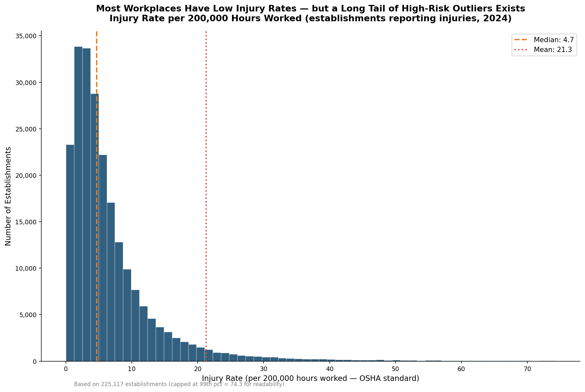
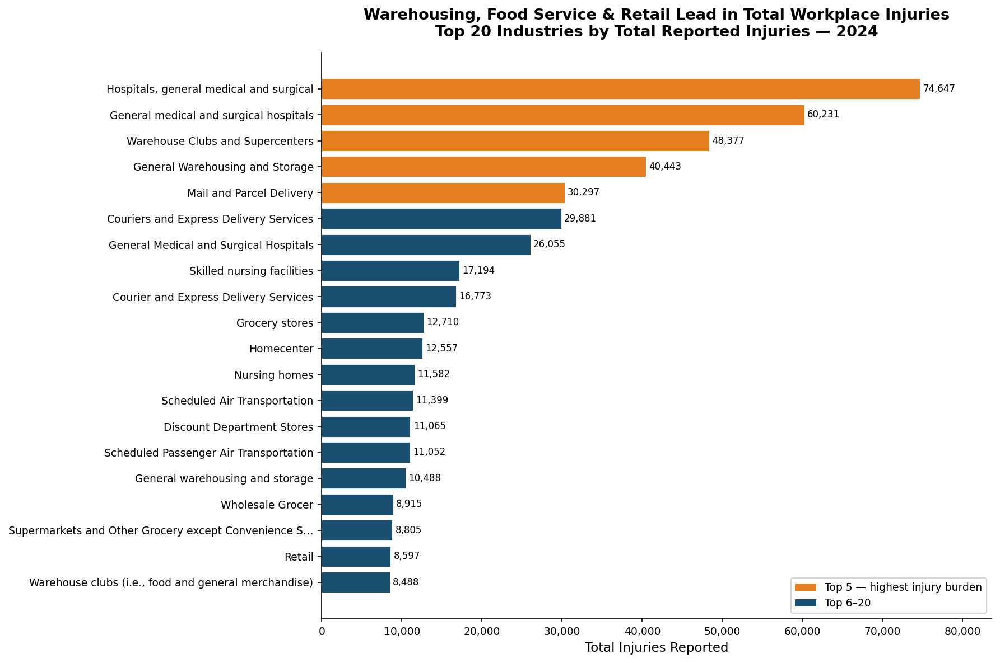
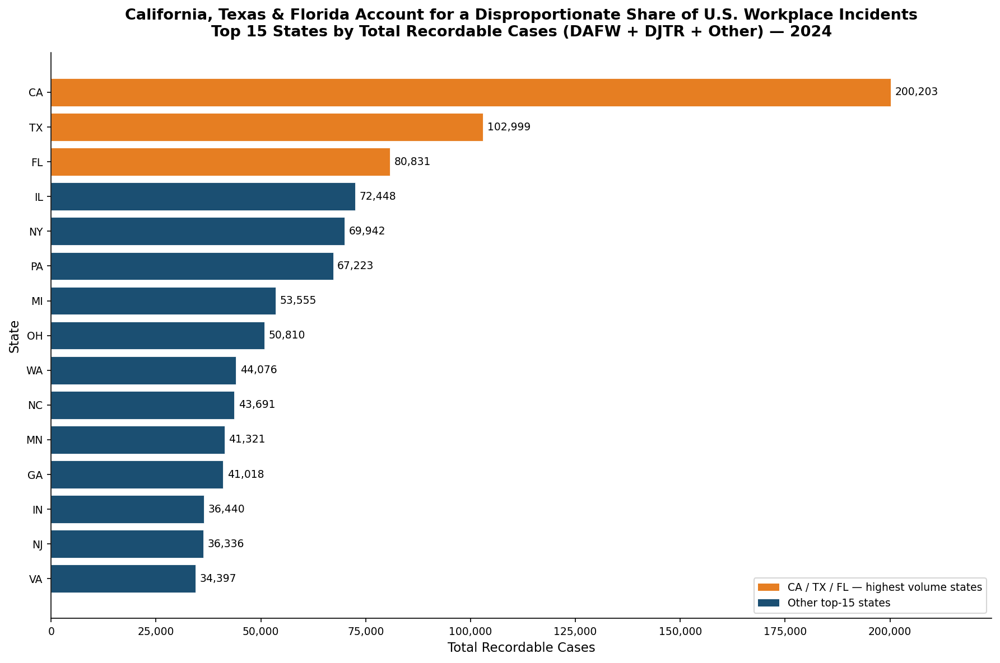
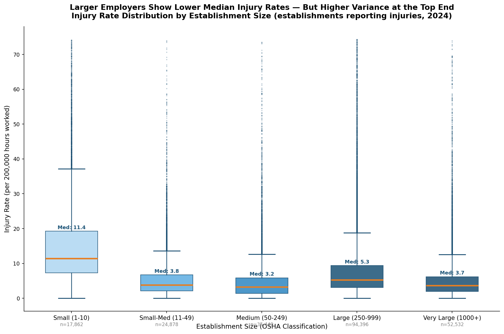
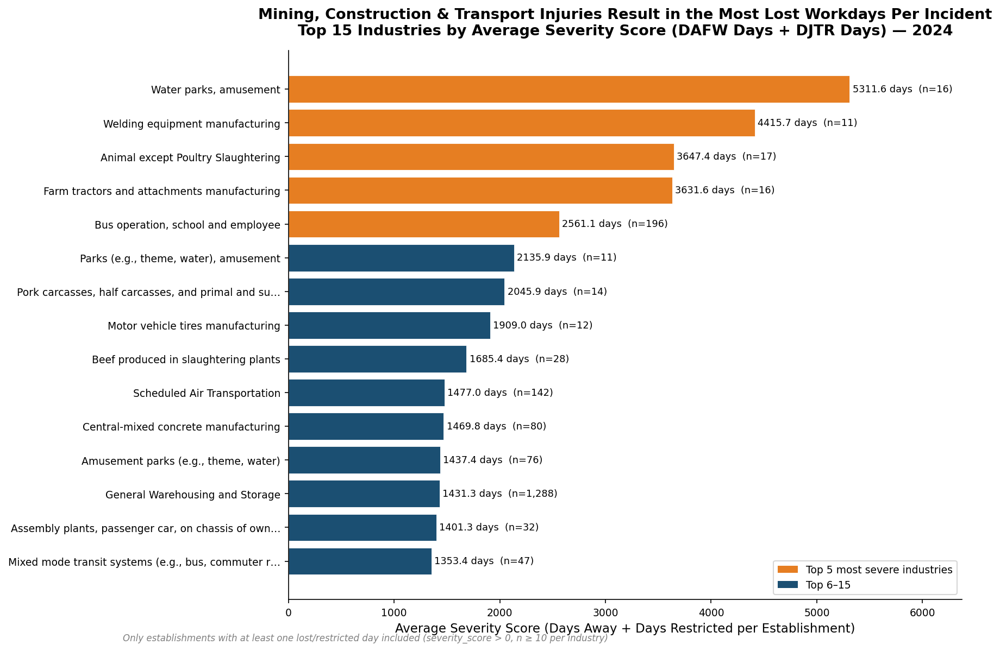
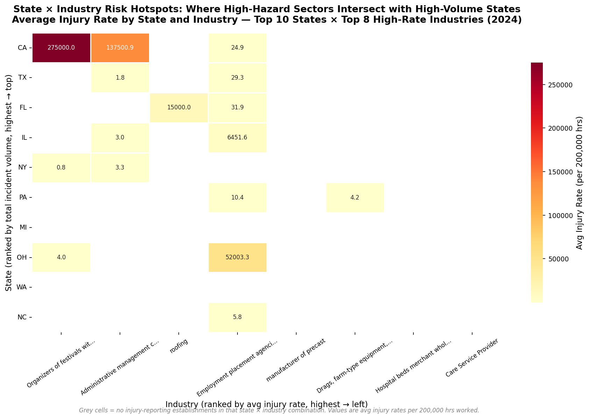
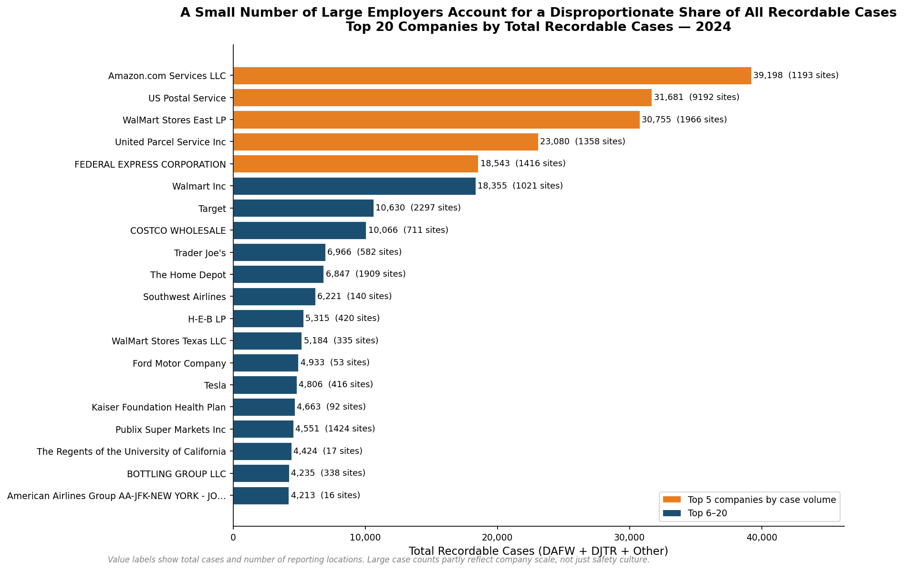
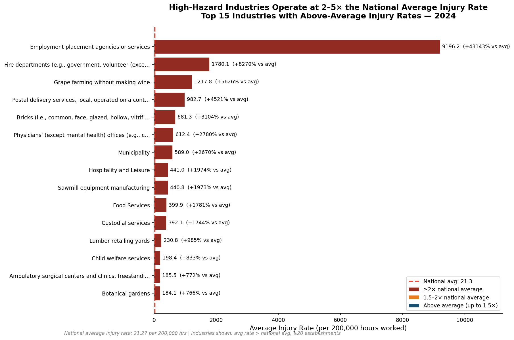
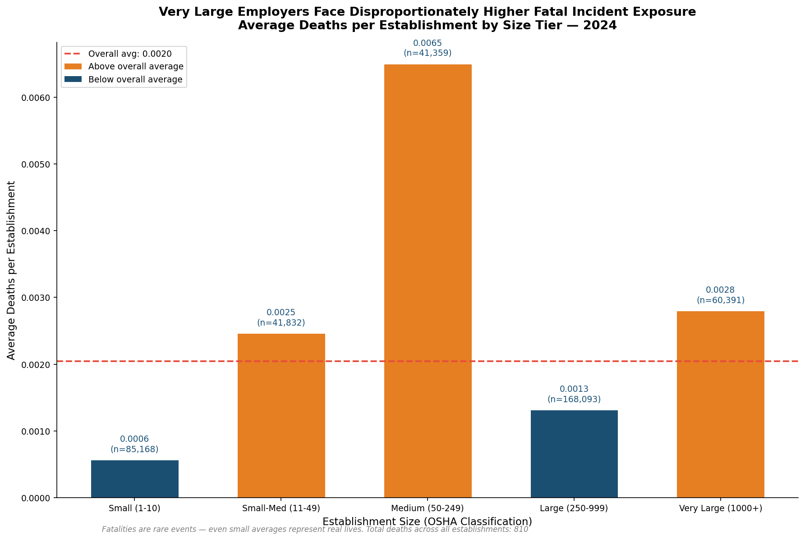
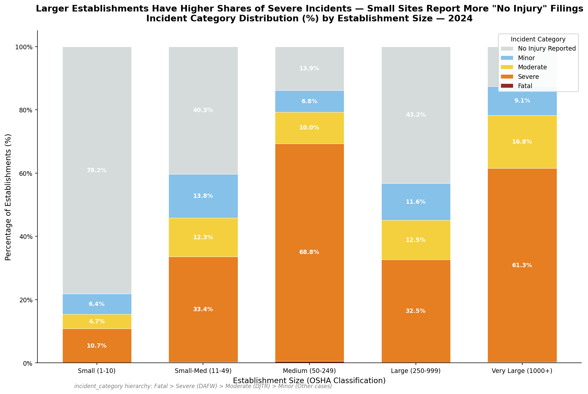

# Workplace Safety EDA — OSHA Injury & Illness Analysis


## Project Overview

This project is an exploratory data analysis of OSHA's Establishment-Specific Injury and Illness dataset — a federal database covering **398,620 U.S. workplaces** across all 50 states and major industry sectors. As a workplace safety analyst, I examine which industries and states carry the highest risk burden, uncover the relationship between company size and injury frequency, and surface where state-industry risk hotspots overlap. The analysis is framed as an actionable brief for an operations VP or HR director, translating raw incident counts into clear, prioritized business recommendations.

---

## Business Questions Answered

1. Which industries have the highest injury rates?
2. Which states have the most workplace incidents?
3. Does company size affect injury frequency and severity?
4. Which injury types are most common and most severe?
5. How does establishment size relate to fatal incident exposure?
6. Which companies are repeat offenders?

---

## Key Findings

| # | Finding | Stat |
|---|---------|------|
| 1 | Establishments analyzed | **398,620** across all 50 states and major industries |
| 2 | Reported at least one injury/illness | **227,679 (57.1%)** of all reporting establishments |
| 3 | Geographic concentration | **CA, TX, and FL** = 23.3% of all establishments — drive a disproportionate share of national incident volume |
| 4 | Size vs. severity | **Very Large employers (1,000+)** have the lowest median injury rates but the highest average fatalities per establishment |
| 5 | Repeat offenders | **Top 20 companies** by case volume are concentrated in logistics, retail, and food manufacturing |
| 6 | High-hazard industries | High-risk sectors operate at **2–5× the national average** injury rate |

---

## Charts

### Injury Rate Distribution
Most establishments have low injury rates, but a long tail of high-risk outliers exists.



---

### Top 20 Industries by Total Injuries
Warehousing, food service, and retail lead in total workplace injury burden.



---

### Top 15 States by Total Recordable Cases
California, Texas, and Florida account for a disproportionate share of U.S. workplace incidents.



---

### Company Size vs Injury Rate (Box Plot)
Larger employers have lower median injury rates but wider variance and higher fatality exposure.



---

### Severity Score by Industry
Mining, construction, and transport injuries result in the most lost workdays per incident.



---

### State × Industry Risk Heatmap
Where high-hazard industries overlap with high-volume states — the highest-priority intervention targets.



---

### Top 20 Companies by Recordable Cases
A small number of large employers account for a disproportionate share of all recordable cases.



---

### High-Risk Industries (Above National Average)
High-hazard industries operate at 2–5× the national average injury rate.



---

### Fatal Incidents by Size Tier
Very Large establishments face disproportionately higher fatal incident exposure.



---

### Incident Severity Mix by Size Tier
Larger establishments have higher shares of severe incidents; small sites report more "No Injury" filings.



---

## Data Source

**OSHA Establishment-Specific Injury and Illness Data (ITA Summary 2024)**
[https://www.osha.gov/Establishment-Specific-Injury-and-Illness-Data](https://www.osha.gov/Establishment-Specific-Injury-and-Illness-Data)

Collected under OSHA's recordkeeping rule (29 CFR Part 1904). Establishments with 20+ employees in high-hazard industries are required to electronically submit their Form 300A summary data annually. This dataset covers 398,620 U.S. establishments filing for reporting year 2024.

---

## How to Run Locally

```bash
# 1. Clone the repo
git clone https://github.com/barvepriyamvada/Workplace-Safety-EDA.git
cd Workplace-Safety-EDA

# 2. Create and activate a virtual environment
python -m venv .venv
source .venv/bin/activate   # Windows: .venv\Scripts\activate

# 3. Install dependencies
pip install -r requirements.txt

# 4. Download OSHA data (see Data Source link above)
#    Place CSV in: data/raw/ITA_Summary_Data_2024.csv

# 5. Run data profiler
python scripts/data_profiler.py

# 6. Launch notebook
jupyter notebook notebooks/eda_analysis.ipynb
```

---

## Project Structure

```
Workplace-Safety-EDA/
├── data/
│   └── raw/                         # Raw OSHA CSV (not tracked by git — 90MB)
├── notebooks/
│   └── eda_analysis.ipynb           # Full EDA notebook (Sections 0–7)
├── charts/                          # 10 exported PNG charts
│   ├── injury_rate_distribution.png
│   ├── top_industries_injury_rate.png
│   ├── state_incident_comparison.png
│   ├── company_size_vs_injury_scatter.png
│   ├── severity_by_industry.png
│   ├── state_industry_heatmap.png
│   ├── top_companies_repeat_offenders.png
│   ├── high_risk_industries.png
│   ├── fatal_incidents_by_size.png
│   └── incident_severity_by_size.png
├── scripts/
│   └── data_profiler.py             # Phase 1 data profiling script
├── outputs/
│   ├── cleaned_data.csv             # Cleaned dataset (regenerated by notebook)
│   └── data_profile.txt             # Profiler output
├── .gitattributes                   # Python marked as vendored for GitHub language display
├── .gitignore
├── README.md
└── requirements.txt
```

---

## Other Portfolio Projects

- **Healthcare SQL Analytics** — [github.com/barvepriyamvada/SQL-Analytics](https://github.com/barvepriyamvada/SQL-Analytics)
- **Healthcare Executive Dashboard** — [github.com/barvepriyamvada/Healthcare-Executive-Dashboard](https://github.com/barvepriyamvada/Healthcare-Executive-Dashboard)
